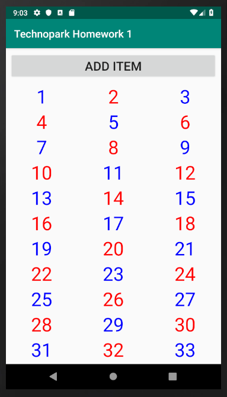
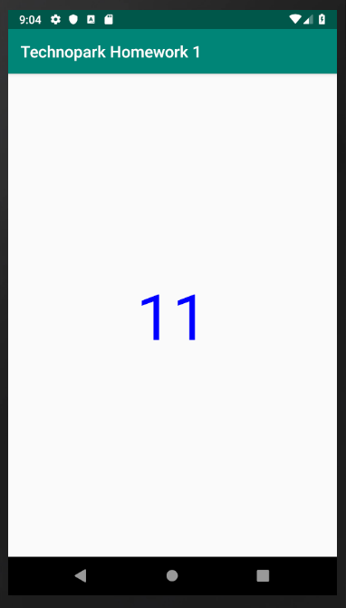

# Домашнее задание по курсу "Разработка Android приложений"

Требуется написать Android приложение с двумя фрагментами и одной Activity. 

Первый фрагмент должен отображать список чисел от 1 до 100 в сетке с 3 столбцами и одну кнопку, по нажатию на которую должен добавить элемент в конце списка. Высота и ширина View, отображающей число, должна быть не меньше 48dp по каждой стороне. 
Чётные числа должны быть написаны красным шрифтом, нечетные - синим. 

При клике на любое число должен открываться второй фрагмент, заменяя собой первый, и отображать выбранное число крупным шрифтом и тем же цветом, что и в списке. По кнопке back должен производиться возврат в список чисел.

Необходимо обеспечить, чтобы в портретной ориентации было 3 столбца в сетке, а в ландшафтной - 4

# Скриншоты

